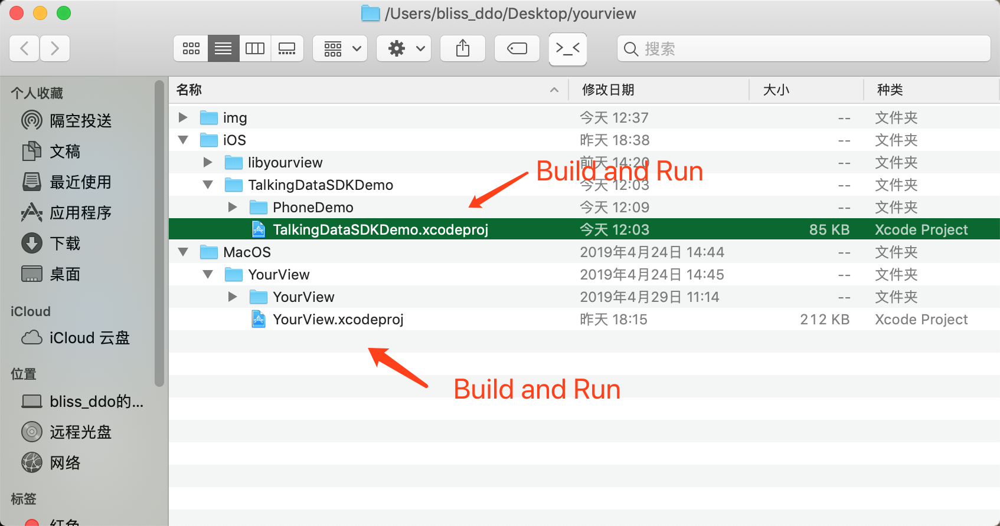
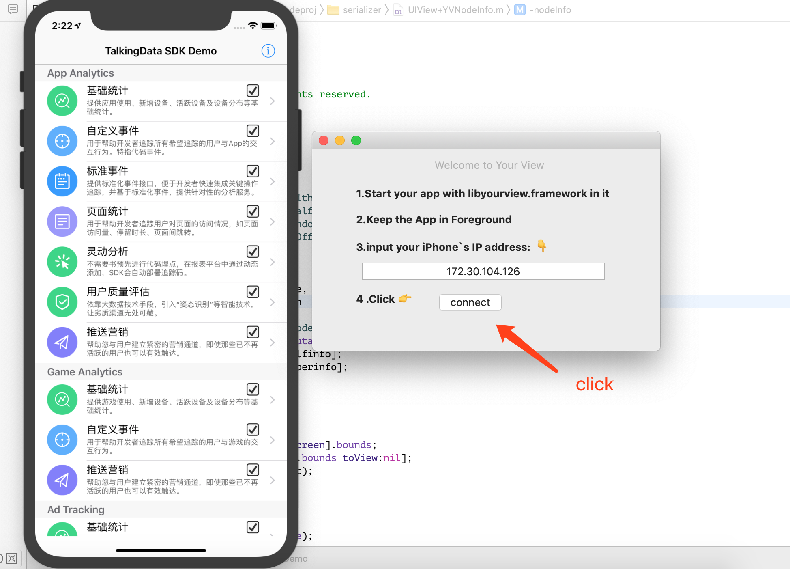
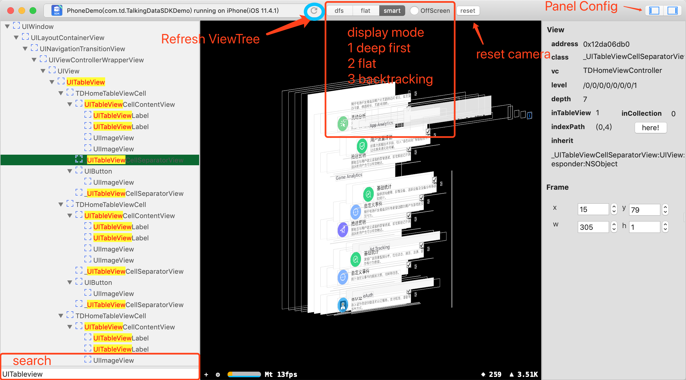
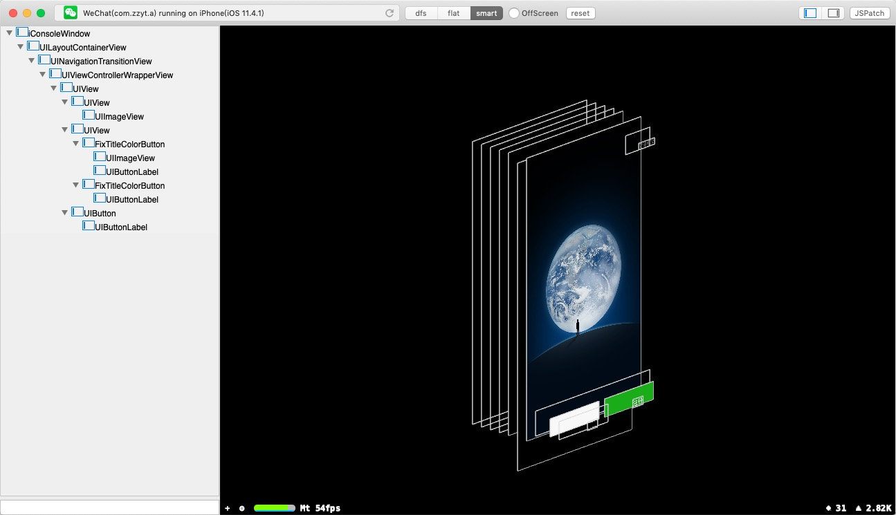

**YourView** is a desktop App in MacOS. You can use it to view iOS App's view hierarchy. I think it could be a `basic project` in app view visualization. Depend on it, you may do your add-on functions's development such as visual tracking like mixpanel, iOS reverse tool just like reveal, frida, even though, you can develop android studio plugin for view debugging. Now I treat it as a iOS reverse tool. Now it is a version of 0.1, I will maintain continuedly.

## Quick Start

- Open `YourView/iOS/TalkingDataSDKDemo/TalkingDataSDKDemo.xcodeproj`. It's a demo project with the libyourview source code as framework in it. Build and Run,keep the demo app in foreground.

- Open `YourView/MacOS/YourView/YourView.xcodeproj`.Build and Run.

  

- Input IP(only ip,without port and scheme) address ,click connect

  

- Enjoy it!

  

## Demo

Camera control:

Search and Live edit

## Tips

- Now the `libyourview.framework` is build as a static libiary. If you want to get a dynamic libiary,you must change the mach-o type in the project settings and build it by yourself.
- You don't need write any code. Once the framework is loaded,it will start a server automatily
- The iOS UIView serilization operation will block the main thread.It maybe faster in Simulator than iOS devices.

## TODO
- Auto network scan using bonjour service like reveal.
- Make the right panel powerful. Now it is hard coded.Make it dynamic,more functions in Object explore just like flex.
- Add the the layout,gesture,viewController infomation to the left tree,just like reveal or Xcode.
- User experience improvment.
- Art works.
- Script editor and inject support,such as JSPatch.
- bug fix.

## Explore others App

- Build this project as a dynamic lib and inject the dynamic lib into others app by using MonkeyDev,IPAPatch,etc. Do it yourself.

  

## Thanks

[swisspol/GCDWebServer](https://github.com/swisspol/GCDWebServer )  This project provide a good http service in iOS App.

## Links
- [TalkingData](https://github.com/TalkingData)

## License

[LICENSE](./LICENSE)

